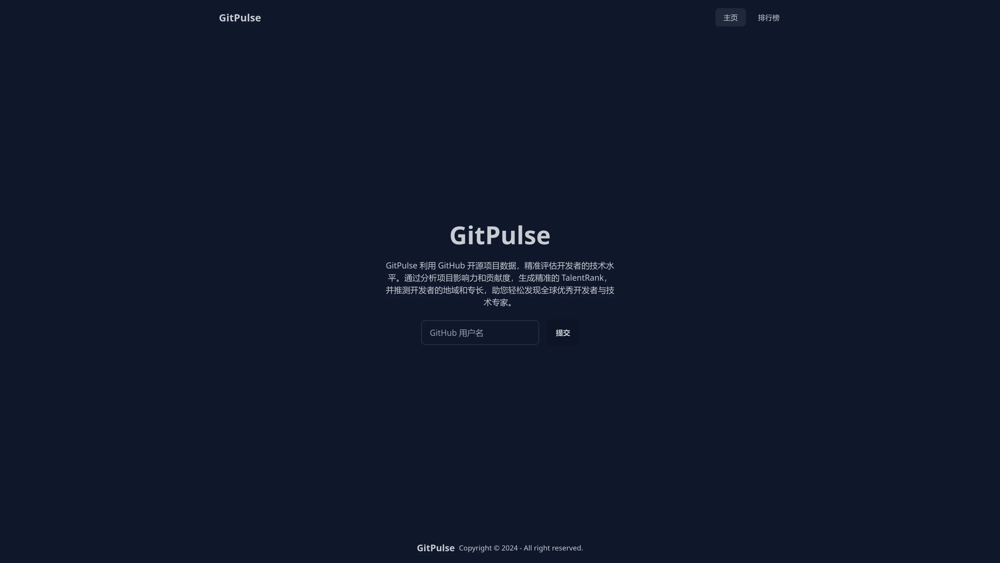

# GitPulse

GitPulse 是一个 GitHub 用户分析工具，通过利用 GitHub 开源项目数据，精准评估开发者的技术水平。通过分析项目影响力和贡献度，生成精准的 TalentRank，并推测开发者的地域和专长，助您轻松发现全球优秀开发者与技术专家。

该项目已获得 [七牛云 1024 创作节校园编程马拉松](https://www.qiniu.com/activity/detail/66cfe17084a4441c29b08be9#list-of-winners) 二等奖。

线上地址：~~[https://pulse.shellwen.com](https://pulse.shellwen.com)，欢迎体验！~~

因服务器负载过高，线上演示已被暂停，如有需要请自行部署。

演示视频：[./docs/demo/demo.mp4](./docs/demo/demo.mp4)

⚡ 特点：

- 前端采用 Vite + React.js，遵守诸如 code splitting 等最佳实践，美观又不失高效；
- 后端使用基于 go-zero 的微服务架构，高性能，支持海量数据处理，可集成 Consul 服务注册与发现，Jaeger 链路追踪，Prometheus 监控等微服务治理组件，支持多节点部署，高可用；
- 数据库采用现代化的 PostgreSQL，支持分库分表，高并发，高可用；
- 在识别用户所在地区时，我们创新性地使用了多种方式，包括但不限于分析用户的声明时区、最近提交 commits 的时区以及用户的个人资料等，在我们内部的测试中，准确率高达 90% 以上。

## 架构设计、部署流程与演示

详见 [docs](./docs) 目录。

## 项目整体分工

| 项目组成 | 负责人 | GitHub ID                                |
| -------- | ------ | ---------------------------------------- |
| 前端     | 陈畅   | [@ShellWen](https://github.com/ShellWen) |
| 后端     | 陈成坤 | [@seri037](https://github.com/seri037)   |

## LICENSE

我们使用 Apache-2.0 License 开源，详见 [LICENSE](./LICENSE) 文件。
