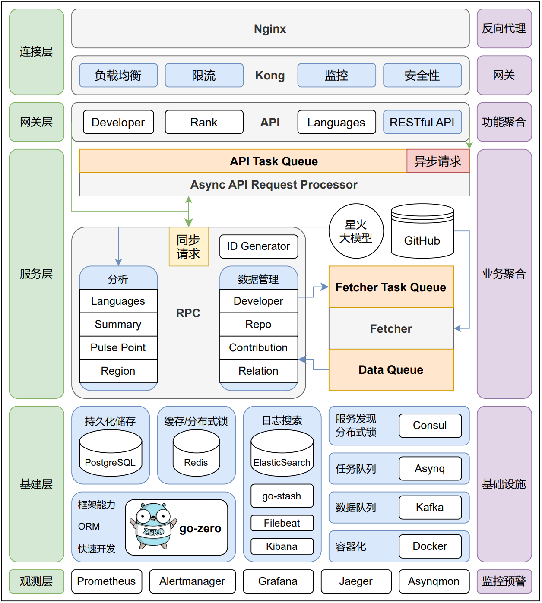
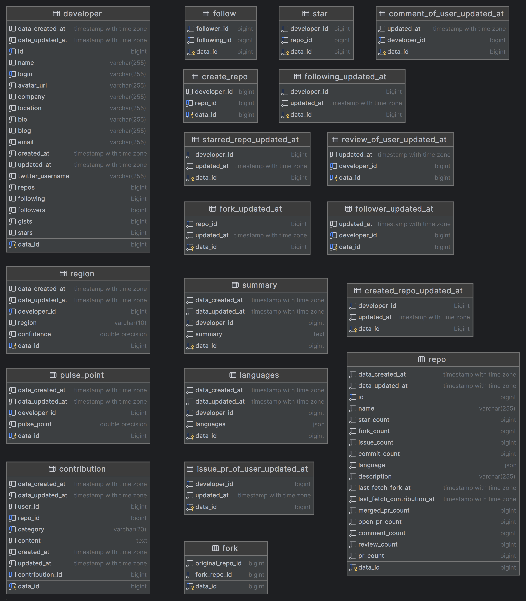

# 技术选型

本项目后端主要采用 **Golang** 作为核心开发语言，并使用少量 Python 脚本以增强特定的处理功能。在整体架构上，选择了以下关键技术栈：

* 微服务框架： **go-zero** 作为核心微服务框架，结合 **goctl api** 工具和 **gRPC proto** 定义服务之间的通信协议。

* 消息队列：**Kafka** 进行数据异步更新处理，同时 **Asynq** 用于管理并发布爬虫任务。

* 数据库：选择 **PostgreSQL** 作为主数据存储。

* 缓存：采用 **Redis** 存储排行榜等高频访问的数据，提升数据读取速度。

* 链路追踪：结合 go-zero 和 **Jaeger** 进行服务调用链的追踪。

* 服务监控：集成  go-zero 提供的 **Prometheus** 监控接口，以便实时查看系统健康状态。

* 服务发现：使用 **Consul** 实现服务发现与健康检查。

* 爬虫库：混合使用 **go-github** 与 **BeautifulSoup** 实现 GitHub API 和网页内容的爬取。

* 代理与负载均衡：采用 **Nginx** 作为网关，实现代理、负载均衡及请求路由。

* 大语言模型：接入**讯飞星火**大模型，用于提升自然语言处理相关的推断能力。

# 接口与服务定义

前后端开发共同遵循 *OpenAPI* 标准，确定接口的输入输出结构和数据格式。

具体地来说，我们在后端采用了 proto 文件规范定义各服务间的 RPC 调用，确保服务接口的一致性。并且使用 api 文件集中定义外部接口，由 API 服务将各个 RPC 服务聚合为标准接口，简化了前端访问。

# 框架特性

后端采用了 Go-zero 微服务框架，利用其以下内建特性确保系统的高性能与高可用性：

* 负载均衡：实现高并发请求分配，避免单个节点超载。

* 限流与熔断：在高峰期自动限流与熔断，避免异常时全局影响。

* 降载：在负载过高时进行降载，并在压力解除后自动恢复。

* 服务监控与链路追踪：为 Prometheus 和 Jaeger 提供便捷接口，方便进行服务状态监控与请求路径分析。

# 服务模块

系统设计了六个微服务模块，各自承担不同的职责，确保系统的稳定与扩展性：

**信息管理**：

* Developer：管理开发者的个人信息和基本属性。

* Repo：维护与管理仓库的相关信息。

* Contribution：跟踪和存储贡献者的贡献记录。

* Relation：维护开发者之间的关系，如关注和项目关联。

**分析**：

* Analysis：专注于开发者能力的评估与分析，负责处理用户的各项分析数据并暂存结果。

**获取与更新（爬虫）**：

* Fetcher：负责从分配的任务队列中拉取数据，爬取并更新最新信息，再推送给对应的管理服务。

# 数据存储与队列管理

为确保数据的一致性与系统的扩展性，我们进行了以下中间件和数据持久化方案的选型：

消息队列：

* Kafka：考虑到其高吞吐量的特性，适合将其Fetcher爬取的大量 GitHub 数据传递，**等待各信息管理服务主动消费**。

* Asynq：弥补Kafka在功能上的不足，管理 Fetcher 更新任务队列，确保任务唯一性并**避免重复爬取**。

数据库与缓存：

* PostgreSQL：用于存储主要业务数据，包括爬取数据和分析结果。所有数据都标注了最近更新时间，方便数据刷新与重新获取。

* Redis：缓存与**排行榜构建**工具，加速数据访问并用于存储高频查询的数据。

同时，我们使用了 goctl model 快速进行ORM代码的生成，提高了开发效率。

# 数据爬取设计

爬取服务利用 go-github 调用 GitHub API 以及 BeautifulSoup 进行静态页面解析来获取 GitHub 仓库的关键数据。针对 GitHub API 的限流机制，采取了以下策略：

* 多Token配置：为每个分布式部署的 Fetcher 配置不同的 Token，以避免限流。

* **数据条数与时效限制：限于近两个月内的贡献记录，限制每次爬取的数据条数至 60 条，保证实时性与效率。**

# 算法模块设计

### 语言统计算法（Language Metrics）

算法受到[GitHub Readme Stats](https://github.com/anuraghazra/github-readme-stats)项目的启发，对用户在不同语言中的活跃度进行量化。公式如下：

设定某种语言的字节数为 bytes，用户使用该语言的仓库数为 n，则该语言的使用度量值为 $k = \sqrt{bytes * n}$ 。而后取该度量值进行百分比计算。

该度量值既考虑到了用户使用某种语言的量，也考虑到了用户对该语言的使用偏好程度。

### PulsePoint算法

PulsePoint指数用于衡量开发者在开源社区中的影响力，衍生自于以下算法构想：

- [如何评价一个开源项目（一）——活跃度](https://blog.frankzhao.cn/how_to_measure_open_source_1/) 
- [如何评价一个开源项目（二）——协作影响力](https://blog.frankzhao.cn/how_to_measure_open_source_2/) 

该算法首先统计开发者的关键贡献行为，包括发起议题、提交合并请求、评论、合并请求被接受、代码审查等五个方面。我们为每种贡献行为赋予一定的权重值，将这些权重相加并对总和开平方，得到开发者的活跃度。但此值仅反映开发者个人活跃度，并未涉及项目影响力和开发者与他人的互动。因此，我们进一步在开发者参与的每个仓库中计算其带来的影响力，并累加至总影响力。

在每个仓库中，我们将贡献者的活跃度分为两部分：一部分是查询的开发者（$A_1$）的贡献，另一部分是其他开发者（$A_2$）作为“虚拟贡献者”总和的贡献。影响力计算公式为：

$
\text{贡献影响力} = \frac{A_1 \times A_2}{A_1 + A_2}
$

从公式可以看出，当一个仓库的贡献全部由单个开发者产生时，A1的值最大，A2则为零，此时仓库为开发者提供的影响力为0。同样，如果开发者在仓库中没有任何贡献，则该仓库为其提供的影响力也为0。因此，贡献的多少及与他人的协作共同决定了开发者的影响力。

在理想的情况下，当A1与A2相等时（即 $A_1 = A_2 = x$），该仓库提供的影响力达到最大值，为 $ x/2 $。由此可见，PulsePoint指数既受到开发者自身活跃度的影响，也受到仓库整体影响力的影响。随着仓库活跃度和参与者的增加，开发者的社区影响力也随之提升。

该算法为衡量开发者在开源社区中的影响力提供了直观且精确的依据。

### 国籍推测算法（Nation Algorithm）

国籍推测依靠以下信息并赋予不同权重：

邮箱后缀 (0.15)

主页时区 (0.20)

简介中的国旗符号 (0.05)

简介中的国家名称 (0.25)

Commit 时区 (0.15)

LLM (0.20)

前五项使用Python爬虫抓取猜测获得。最后我们接入讯飞星火，通过分析用户的评论语言、描述等信息来辅助猜测。

# 服务监控与链路追踪

利用 go-zero 提供的即用接口连接 **Jaeger** 和 **Prometheus** 面板，构建了完整的服务监控与链路追踪体系。实时监控系统状态，通过报警机制确保系统的稳定性。同时追踪各服务的调用链，便于诊断性能瓶颈并优化服务响应。